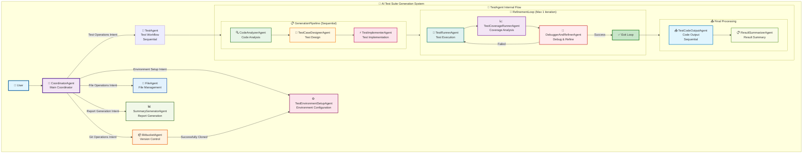

```mermaid
graph TB
    subgraph System["🌟 AI Test Suite Generation System"]
        User[👤 User] --> Root[🎯 CoordinatorAgent<br/>Main Coordinator]
        Root --> |Git Operations Intent| BB[📦 BitbucketAgent<br/>Version Control]
        Root --> |Test Operations Intent| TA[🧪 TestAgent<br/>Test Workflow<br/>Sequential]
        Root --> |Environment Setup Intent| ENV[⚙️ TestEnvironmentSetupAgent<br/>Environment Configuration]
        Root --> |File Operations Intent| FA[📁 FileAgent<br/>File Management]
        Root --> |Report Generation Intent| SG[📊 SummaryGeneratorAgent<br/>Report Generation]
        BB --> |Successfully Cloned| ENV
        subgraph TestAgent["🧪 TestAgent Internal Flow"]
            direction TB
            subgraph GP["📋 GenerationPipeline (Sequential)"]
                direction LR
                CA[🔍 CodeAnalyzerAgent<br/>Code Analysis] 
                CA --> TCD[📝 TestCaseDesignerAgent<br/>Test Design]
                TCD --> TI[⚡ TestImplementerAgent<br/>Test Implementation]
            end
            subgraph RL["🔄 RefinementLoop (Max 1 iteration)"]
                direction LR
                TR[🏃 TestRunnerAgent<br/>Test Execution] 
                TR --> TCR[📈 TestCoverageRunnerAgent<br/>Coverage Analysis]
                TCR --> DAR[🐛 DebuggerAndRefinerAgent<br/>Debug & Refine]
                DAR --> |Failed| TR
                DAR --> |Success| Exit[✅ Exit Loop]
            end
            subgraph Final["📤 Final Processing"]
                direction LR
                TCO[📤 TestCodeOutputAgent<br/>Code Output<br/>Sequential]
                TCO --> RS[📋 ResultSummarizerAgent<br/>Result Summary]
            end
            GP --> RL
            Exit --> Final
        end
        TA --> GP
    end
    style User fill:#e1f5fe,stroke:#01579b,stroke-width:3px
    style Root fill:#f3e5f5,stroke:#4a148c,stroke-width:3px
    style BB fill:#fff3e0,stroke:#e65100,stroke-width:2px
    style ENV fill:#fce4ec,stroke:#880e4f,stroke-width:2px
    style FA fill:#e3f2fd,stroke:#0d47a1,stroke-width:2px
    style SG fill:#f1f8e9,stroke:#33691e,stroke-width:2px
    style CA fill:#e8f5e8,stroke:#2e7d32,stroke-width:2px
    style TCD fill:#fff8e1,stroke:#f57f17,stroke-width:2px
    style TI fill:#fce4ec,stroke:#c2185b,stroke-width:2px
    style TR fill:#e0f2f1,stroke:#00695c,stroke-width:2px
    style TCR fill:#f3e5f5,stroke:#7b1fa2,stroke-width:2px
    style DAR fill:#ffebee,stroke:#c62828,stroke-width:2px
    style TCO fill:#e1f5fe,stroke:#0277bd,stroke-width:2px
    style RS fill:#f9fbe7,stroke:#689f38,stroke-width:2px
    style Exit fill:#c8e6c9,stroke:#388e3c,stroke-width:3px
```
